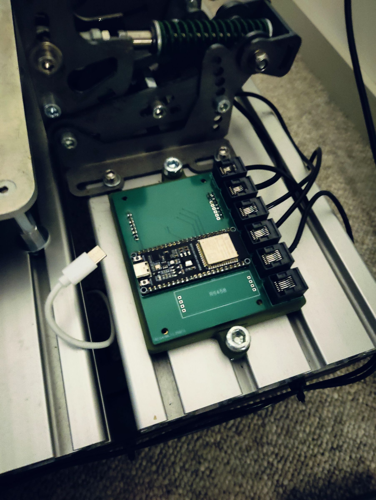

# SimPedalsESP32

DIY sim racing pedals using an ESP32-S3. Supports brake, accelerator, clutch, and handbrake — shows up as a USB gamepad on your PC.

## Hardware

- **ESP32-S3** microcontroller
- **Brake** — load cell + ADS1256 ADC
- **Accelerator & Clutch** — Hall-effect sensors
- **Handbrake** — load cell + HX711 ADC
- **2 buttons** for shifter / calibration

The `hardware/` folder has the KiCad PCB project and STEP files for a 3D-printed case.

## Building

Arduino IDE project targeting the ESP32-S3. Install the ESP32 board package, then add these libraries:

- [ADS1256](https://github.com/adienakhmad/ADS1256)
- [Joystick_ESP32S2](https://github.com/schnoog/Joystick_ESP32S2)
- [HX711](https://github.com/bogde/HX711)
- [Bounce2](https://github.com/thomasfredericks/Bounce2)

Open `SimPedalsESP32.ino` and upload.

## Calibration

1. Open a serial monitor at 115200 baud.
2. Hold **Button 1** for 3 seconds to enter calibration mode.
3. Press **Button 2** to cycle through pedals.
4. Leave each pedal at rest for 2 seconds, then press it to its max. The serial monitor shows the current raw value, min, and max in real time.
5. Hold **Button 1** for 3 seconds to save and exit.

Calibration is saved to flash and persists across power cycles.
